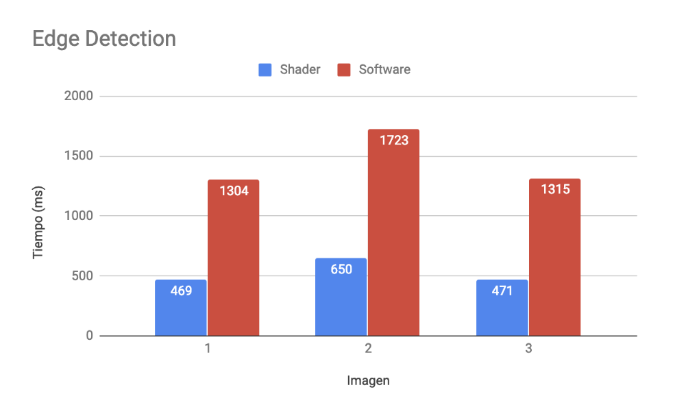
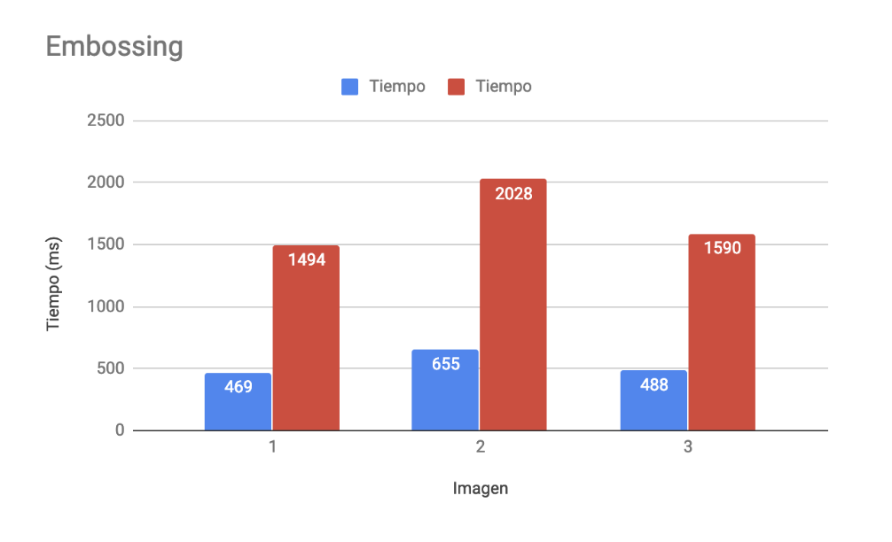
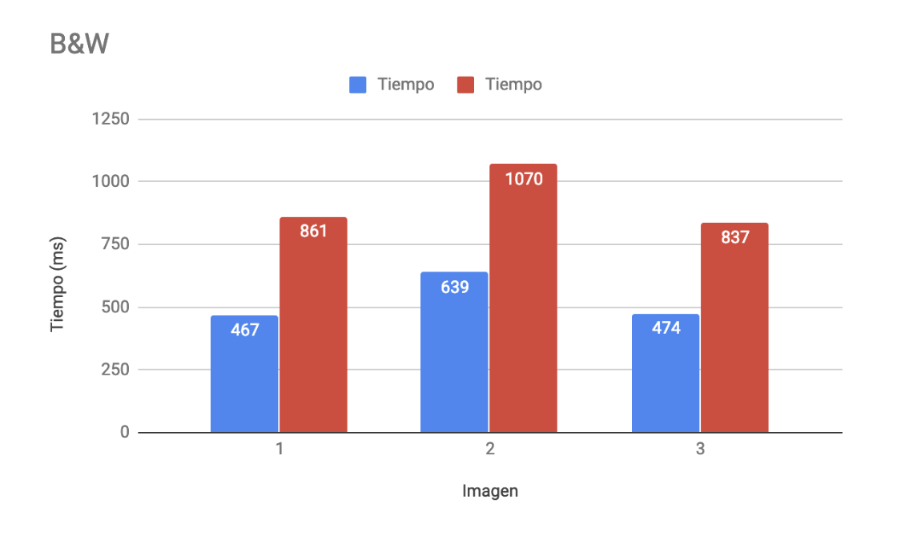

# Taller de shaders

## Propósito

Estudiar los [patrones de diseño de shaders](http://visualcomputing.github.io/Shaders/#/4).

## Tarea

Escoja una de las siguientes dos:

1. Hacer un _benchmark_ entre la implementación por software y la de shaders de varias máscaras de convolución aplicadas a imágenes y video.
2. Estudiar e implementar el [shadow mapping](http://www.opengl-tutorial.org/intermediate-tutorials/tutorial-16-shadow-mapping/). Se puede emplear la escena del [punto 2 del taller de transformaciones](https://github.com/VisualComputing/Transformations_ws), así como la librería [frames](https://github.com/VisualComputing/frames). Ver el ejemplo [ShadowMap](https://github.com/VisualComputing/frames/tree/master/examples/demos/ShadowMap).

## Integrantes

Máximo tres.

Complete la tabla:

| Integrante | github nick |
|------------|-------------|
| Juan David Saab           | juansaab |

## Informe

Se realizó una comparación entre tres diferentes máscaras aplicadas a imágenes utilizando dos métodos: aplicación por software y aplicación en un Shader. Todo el código de la aplicación se desarrolló en Procesing, haciendo uso de el objeto Image y la posibilidad de acceder directamente a cada pixel con la función Image.loadPixels() de Processing.

Los filtros aplicados fueron:

* Blanco y negro
* Detección de bordes
* Realce

Luego se evaluó el desempeño de cada filtro, y se compararon ambos métodos.

Resultados:
A continuación se presentan algunos resultados de tiempo de renderizado para cada método y filtro.

### B&W

### Edge

### Embossing

Se observa a simple vista que el desempeño del filtro en shader es entre dos y tres veces mejor que el del filtro por software.

### Ejecucion

## Entrega

Fecha límite Domingo 10/3/19 a las 24h.
